# SAS-HAR Architecture Diagrams

This document provides detailed architecture diagrams for the SAS-HAR (Self-Supervised Attention-based Segmentation for Human Activity Recognition) framework using Mermaid syntax.

## Table of Contents

1. [System Overview](#1-system-overview)
2. [SAS-HAR Model Architecture](#2-sas-har-model-architecture)
3. [CNN Feature Encoder](#3-cnn-feature-encoder)
4. [Efficient Linear Attention Transformer](#4-efficient-linear-attention-transformer)
5. [Task-Specific Heads](#5-task-specific-heads)
6. [TCBL Self-Supervised Module](#6-tcbl-self-supervised-module)
7. [Training Pipeline](#7-training-pipeline)
8. [Edge Deployment Pipeline](#8-edge-deployment-pipeline)

---

## 1. System Overview

The complete SAS-HAR pipeline from raw sensor data to activity predictions.

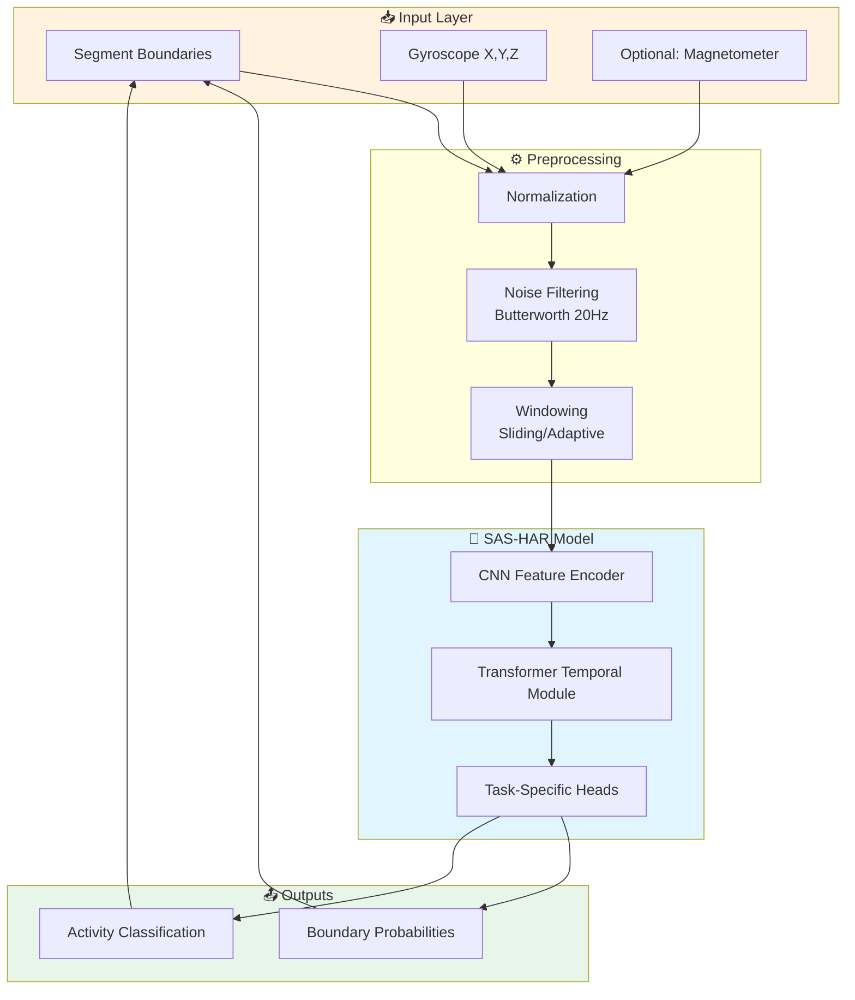

---

## 2. SAS-HAR Model Architecture

The core model architecture combining CNN encoder, Transformer temporal module, and task heads.

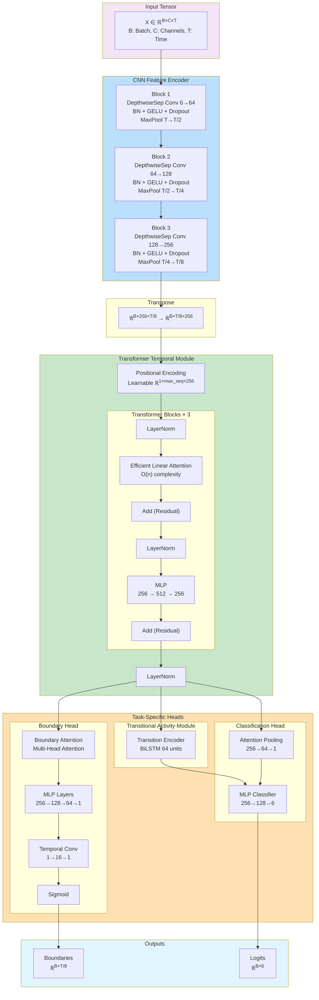

---

## 3. CNN Feature Encoder

Detailed view of the depthwise separable convolution blocks.

```mermaid
flowchart LR
    subgraph Input["Input"]
        IN["Sensor Data<br/>ℝ<sup>B×6×T</sup>"]
    end
    
    subgraph Block1["Block 1: Local Features"]
        direction TB
        D1["Depthwise Conv<br/>k=5, groups=6"]
        P1["Pointwise Conv<br/>6→64"]
        BN1["BatchNorm1d"]
        G1["GELU"]
        DO1["Dropout 0.1"]
        MP1["MaxPool1d<br/>k=2, s=2"]
        OUT1["Output: ℝ<sup>B×64×T/2</sup>"]
    end
    
    subgraph Block2["Block 2: Mid Features"]
        direction TB
        D2["Depthwise Conv<br/>k=3, groups=64"]
        P2["Pointwise Conv<br/>64→128"]
        BN2["BatchNorm1d"]
        G2["GELU"]
        DO2["Dropout 0.1"]
        MP2["MaxPool1d<br/>k=2, s=2"]
        OUT2["Output: ℝ<sup>B×128×T/4</sup>"]
    end
    
    subgraph Block3["Block 3: High-Level Features"]
        direction TB
        D3["Depthwise Conv<br/>k=3, groups=128"]
        P3["Pointwise Conv<br/>128→256"]
        BN3["BatchNorm1d"]
        G3["GELU"]
        DO3["Dropout 0.1"]
        MP3["MaxPool1d<br/>k=2, s=2"]
        OUT3["Output: ℝ<sup>B×256×T/8</sup>"]
    end
    
    IN --> D1 --> P1 --> BN1 --> G1 --> DO1 --> MP1 --> OUT1
    OUT1 --> D2 --> P2 --> BN2 --> G2 --> DO2 --> MP2 --> OUT2
    OUT2 --> D3 --> P3 --> BN3 --> G3 --> DO3 --> MP3 --> OUT3
    
    style Block1 fill:#e3f2fd
    style Block2 fill:#e8f5e9
    style Block3 fill:#fff3e0
```

### Depthwise Separable Convolution Detail

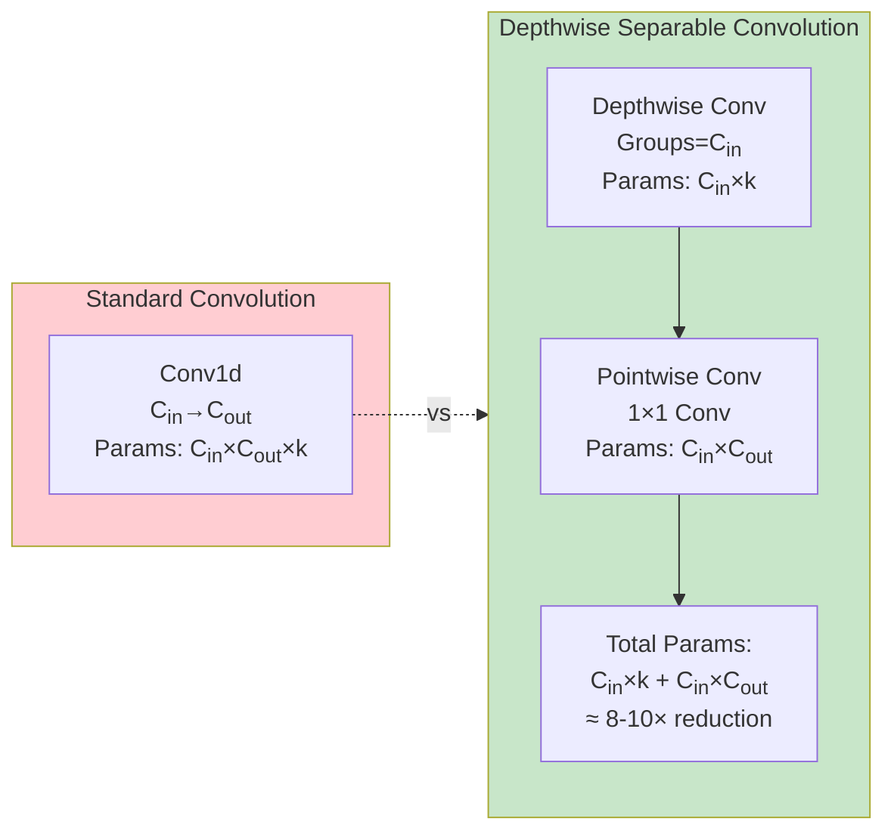

---

## 4. Efficient Linear Attention Transformer

The O(n) complexity attention mechanism enabling long sequence processing.

```mermaid
flowchart TB
    subgraph Input["Input Features"]
        X["X ∈ ℝ<sup>B×T×D</sup>"]
    end
    
    subgraph Projections["Linear Projections"]
        Q["Q = W<sub>q</sub>X<br/>ℝ<sup>B×T×D</sup>"]
        K["K = W<sub>k</sub>X<br/>ℝ<sup>B×T×D</sup>"]
        V["V = W<sub>v</sub>X<br/>ℝ<sup>B×T×D</sup>"]
    end
    
    subgraph Reshape["Multi-Head Reshape"]
        QH["Q: ℝ<sup>B×H×T×d</sub><sub>h</sub>""]
        KH["K: ℝ<sup>B×H×T×d</sub><sub>h</sub>""]
        VH["V: ℝ<sup>B×H×T×d</sub><sub>h</sub>""]
    end
    
    subgraph Kernel["Kernel Function"]
        KF["φ(x) = elu(x) + 1<br/>Ensures positive values"]
    end
    
    subgraph LinearAttn["Linear Attention Computation"]
        direction TB
        KV["K<sup>T</sup>V<br/>ℝ<sup>B×H×d<sub>h</sub>×d<sub>h</sub></sup><br/>O(d²)"]
        QKV["Q(K<sup>T</sup>V)<br/>ℝ<sup>B×H×T×d<sub>h</sub></sup><br/>O(Td)"]
        NORM["Normalize<br/>Q·K<sup>T</sup>·1"]
    end
    
    subgraph Output["Output"]
        RES["Reshape: ℝ<sup>B×T×D</sup>"]
        PROJ["Output Projection<br/>W<sub>o</sub>"]
        OUT["Output: ℝ<sup>B×T×D</sup>"]
    end
    
    X --> Q
    X --> K
    X --> V
    Q --> QH
    K --> KH
    V --> VH
    QH --> KF
    KH --> KF
    KF --> KV
    VH --> KV
    KV --> QKV
    QKV --> NORM
    NORM --> RES
    RES --> PROJ
    PROJ --> OUT
    
    style LinearAttn fill:#e8f5e9
    style Kernel fill:#fff3e0
```

### Complexity Comparison

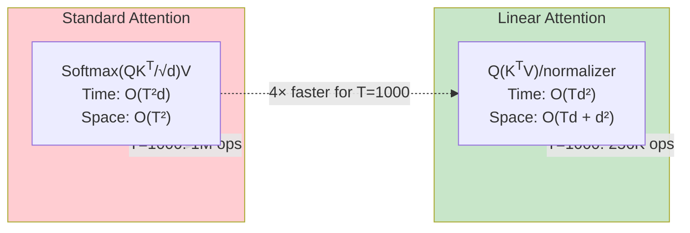

---

## 5. Task-Specific Heads

### Boundary Detection Head

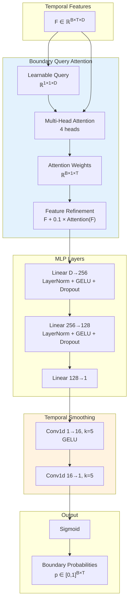

### Classification Head

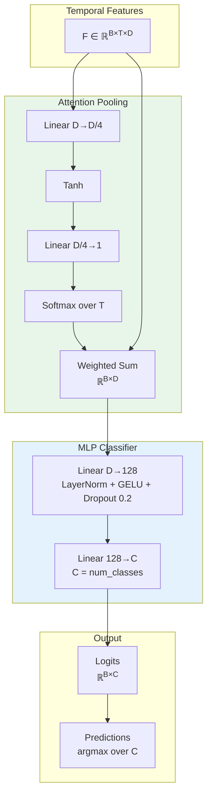

---

## 6. TCBL Self-Supervised Module

The Temporal Contrastive Boundary Learning module for self-supervised pre-training.

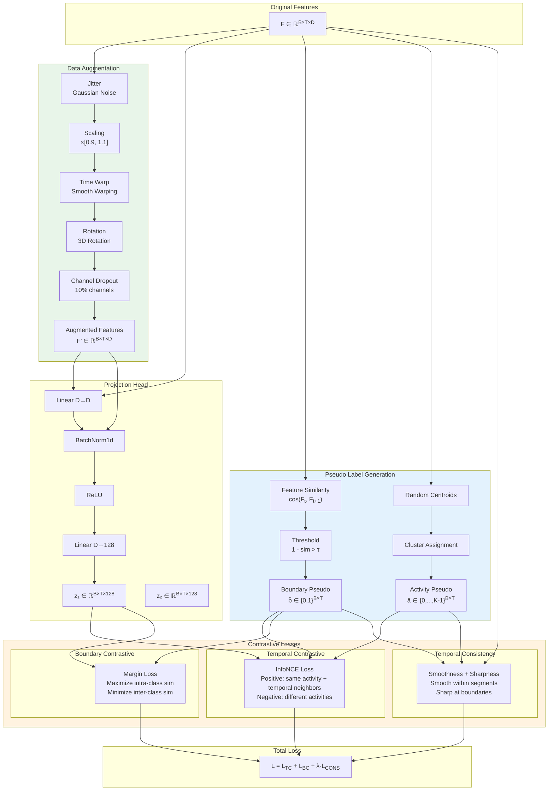

### Augmentation Strategies

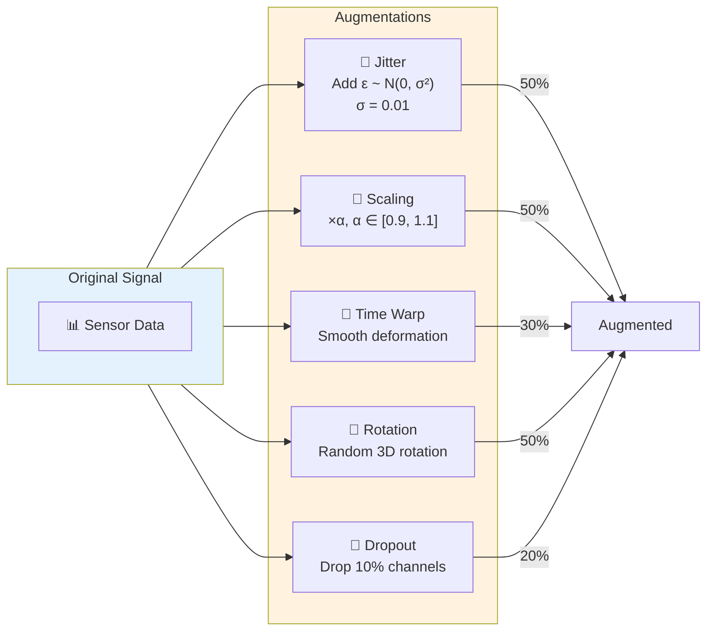

---

## 7. Training Pipeline

Complete training workflow from data loading to model evaluation.

```mermaid
flowchart TB
    subgraph Data["Data Preparation"]
        direction LR
        D1["Dataset Loading<br/>UCI-HAR/WISDM/PAMAP2"]
        D2["Preprocessing<br/>Normalize + Filter"]
        D3["Windowing<br/>Sliding/Adaptive"]
        D4["DataLoader<br/>Batch + Shuffle"]
    end
    
    subgraph Pretrain["Optional: TCBL Pre-training"]
        P1["Load Unlabeled Data"]
        P2["Generate Augmentations"]
        P3["Compute Contrastive Loss"]
        P4["Update Encoder Weights"]
    end
    
    subgraph Training["Supervised Training"]
        direction TB
        T1["Forward Pass"]
        T2["Compute Losses<br/>L<sub>cls</sub> + λ·L<sub>bnd</sub>"]
        T3["Backward Pass"]
        T4["Gradient Clipping<br/>max_norm = 1.0"]
        T5["Optimizer Step<br/>AdamW"]
        T6["Scheduler Step<br/>CosineAnnealing"]
    end
    
    subgraph Validation["Validation"]
        V1["Evaluate on Val Set"]
        V2["Compute Metrics<br/>Acc, F1, Boundary F1"]
        V3["Early Stopping<br/>patience = 10"]
        V4["Save Best Model"]
    end
    
    subgraph Eval["Final Evaluation"]
        E1["Load Best Model"]
        E2["Test Set Evaluation"]
        E3["LOSO Cross-Validation"]
        E4["Generate Report"]
    end
    
    D1 --> D2 --> D3 --> D4
    D4 --> P1
    P1 --> P2 --> P3 --> P4
    P4 --> T1
    D4 --> T1
    T1 --> T2 --> T3 --> T4 --> T5 --> T6
    T6 --> V1
    V1 --> V2 --> V3
    V3 --> |"Continue"| T1
    V3 --> |"Stop"| V4
    V4 --> E1 --> E2 --> E3 --> E4
    
    style Data fill:#e3f2fd
    style Training fill:#e8f5e9
    style Validation fill:#fff3e0
    style Eval fill:#fce4ec
```

---

## 8. Edge Deployment Pipeline

Model optimization pipeline for edge device deployment.

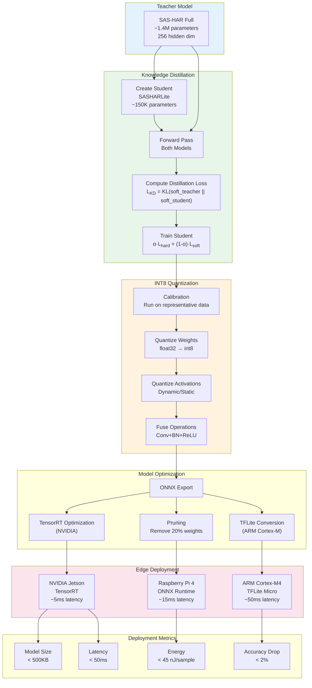

### Model Size Comparison

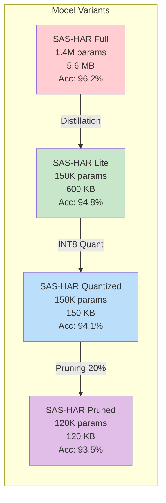

---

## Legend

| Symbol | Meaning |
|--------|---------|
| 📥 | Input layer |
| ⚙️ | Processing/Transformation |
| 🧠 | Neural network component |
| 📤 | Output layer |
| 🔹 | Augmentation operation |
| 📊 | Data/Signal |

## Dimension Notation

- **B**: Batch size
- **C**: Number of channels (typically 6 for acc+gyro)
- **T**: Time steps (sequence length)
- **D**: Feature dimension (hidden size)
- **H**: Number of attention heads
- **d<sub>h</sub>**: Head dimension (D/H)
- **K**: Number of activity classes

## File References

| Component | File Path |
|-----------|-----------|
| SAS-HAR Model | `sashar/models/sas_har.py` |
| CNN Encoder | `sashar/models/encoder.py` |
| Task Heads | `sashar/models/heads.py` |
| TCBL Module | `sashar/models/tcbl.py` |
| Training Script | `scripts/train.py` |
| Mathematical Framework | `docs/theory/mathematical_framework.md` |
